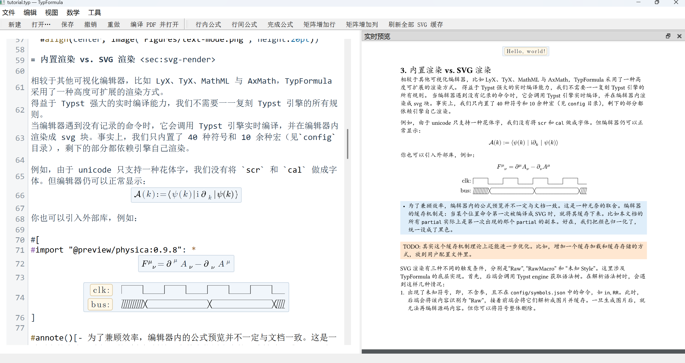

# TypFormula — 公式可视化的 Typst 编辑器

TypFormula 是一款支持结构化公式编辑的 Typst 桌面编辑器。你可以直接编辑正文源码，并在公式中通过键盘操作分式、上下标和矩阵。

项目使用 Typst 引擎渲染公式，支持自定义宏和已安装的 Typst 包。可静态展开的宏支持参数编辑，其他受支持片段由引擎渲染显示。

**项目目前处于早期开发阶段，主要在 Windows 上开发和验证，当前提供源码运行方式。欢迎试用与反馈。**



## 核心功能

- **结构化公式编辑**：通过键盘进入分式、根式、上下标和矩阵的各个槽位，支持选区、复制粘贴和撤销。
- **自定义宏**：保留宏调用源码，对可展开的宏直接编辑实参；文档内的宏定义块支持语法高亮，确认后才更新公式。
- **源码与语言服务**：正文直接编辑 Typst 源码；接入 Tinymist 后支持补全、诊断、悬停、定义跳转和格式化。
- **预览与导出**：可开启 Tinymist 实时页面预览，也可编译当前未保存内容并导出 PDF/SVG。
- **文档编辑**：提供源码栏、大纲、分栏、查找替换，以及 Typst 包的浏览与安装。

## 快速开始

### 环境准备

| 依赖 | 说明 |
| --- | --- |
| Windows | 当前提供 Windows 构建和启动脚本 |
| Python 3.10+ | 本机验证版本为 Python 3.11.5 |
| Rust 与 Cargo | 本机验证版本为 Rust 1.98.1，使用 `x86_64-pc-windows-msvc` 工具链；尚未单独验证项目的最低 Rust 版本 |
| C++ 构建工具 | MSVC 工具链需要 Visual Studio Build Tools 的 C++ 桌面开发工具及 Windows SDK |
| PyQt5 / PyQtWebEngine | 通过下方 requirements 命令安装；PyQtWebEngine 用于实时页面预览 |
| Tinymist（可选） | 提供语言服务和实时页面预览；不影响基本编辑与原生公式渲染、PDF/SVG 导出 |

### 首次构建

克隆或下载仓库后，在仓库根目录打开 PowerShell，执行：

```powershell
# 安装 Python 界面依赖
python -m pip install -r desktop/requirements.txt

# 首次构建需要联网下载 Rust 依赖；host 和适配器是两个独立工作区
cargo fetch --locked
cargo fetch --locked --manifest-path native-adapter/Cargo.toml

# 构建后端与适配器，并检查 Python 依赖
.\build-desktop.cmd
```

仓库已包含固定版本的 Typst 引擎源码，无需另外克隆引擎或安装 Typst CLI。其他 Rust 依赖仍需通过 `cargo fetch` 下载；构建脚本使用 `--offline --locked`，因此不能在空依赖缓存上直接运行。首次 release 编译耗时较长，后续构建可复用缓存。

### 启动

```powershell
# 打开编辑器
.\start-desktop.cmd

# 或打开指定文档
.\start-desktop.cmd "D:\documents\article.typ"
```

构建脚本只构建，不启动窗口；目前尚未提供独立安装器。需要指定 Python 路径或使用其它后端构建时，参见 [桌面端说明](docs/desktop.md)。

### 启用语言服务与实时预览

安装 Tinymist 后，将其加入 `PATH`，或通过环境变量 `TINYMIST_BIN` 指定可执行文件。程序也会在本机 VS Code / Cursor 扩展目录中查找 Tinymist。

- **语言服务**：`Ctrl+Space` 补全，`F12` 跳转定义，`Ctrl+Alt+F` 格式化；鼠标停留可查看诊断和符号说明。
- **实时预览**：通过“视图 → 显示 / 隐藏实时预览”开启，默认关闭。
- **包管理**：通过“工具 → 浏览 @local / @preview 包…”安装指定版本；“安装并插入 import”会同时插入导入语句。

## 第一个公式

1. 启动编辑器，按 `Ctrl+Alt+B` 插入行间公式并进入编辑。
2. 输入 `\frac`，按 Enter 确认，显示分子和分母两个空槽。
3. 在分子中输入 `a`，按 Tab 切换到分母，输入 `b`。
4. 按 `Ctrl+Alt+Return` 完成公式，返回正文。
5. 按 F5 编译当前内容，并用系统默认 PDF 阅读器打开结果。

更多常用操作：

| 操作 | 默认按键 |
| --- | --- |
| 插入行内公式 | `Ctrl+Alt+I` |
| 输入公式命令 | `\`，随后输入名称并按 Enter |
| 创建上标 / 下标 | `^` / `_`，创建后显示当前空槽 |
| 切换公式槽位 | Tab / Shift+Tab |
| 完成公式 | `Ctrl+Alt+Return` |
| 保存 | `Ctrl+S` |
| 撤销 / 重做 | `Ctrl+Z` / `Ctrl+Y` |

相邻的 `#let` 定义会合成紧凑的源码块。点击或用方向键进入，Enter 确认退出、Shift+Enter 换行、Esc 取消；未确认的草稿不会更新公式。快捷键可在“工具 → 设置/快捷键”中调整。

完整示例见 [TypFormula 使用教程](docs/tutorial.typ)，可直接用编辑器打开：

```powershell
.\start-desktop.cmd .\docs\tutorial.typ
```

教程使用 `@preview/latex-lookalike:0.1.4` 包。若提示缺少依赖，请先通过包管理器安装；“第一个公式”的示例不需要额外宏包。

## 当前限制

- 编辑区以结构编辑为主，复杂装饰、伸缩定界符和部分布局可能简化；最终排版以 Typst 编译生成的 PDF/SVG 为准。
- 宏的结构展开采用受限的静态分析，并非所有宏包内容都能逐槽编辑。未建模的受支持片段由引擎取图，失败时可回到源码修复。
- Tinymist 实时预览尚未接入与编辑源码之间的双向定位。
- 当前文档所在目录作为编译根目录，外部资源应放在该目录或子目录中；尚未安装的包依赖需要先安装。
- 目前主要验证 Windows 环境；其他平台尚无完整的构建、运行验证流程。

## 文档与反馈

- [使用教程](docs/tutorial.typ)：公式编辑操作与示例。
- [桌面端说明](docs/desktop.md)：完整操作、依赖配置及显示行为。
- [架构说明](docs/architecture.md)：前后端分层、通信与缓存。
- [编辑模型](docs/editing-model.md)：槽位、光标和宏参数的可编辑性。
- [Kind 能力清单](docs/kind-inventory.md)：结构支持范围与引擎差异。
- [验证记录](docs/validation.md)：各轮修复与测试结果。

欢迎通过仓库 Issues 报告问题或提出建议。报告问题时，请尽量提供：

- 能复现问题的最小 `.typ` 源码，以及需要的宏或包版本。
- 从打开文档开始的操作步骤，特别是公式中的输入顺序与按键。
- 预期结果与实际结果；显示问题可附截图。
- 操作系统、Python/Rust/Tinymist 版本，以及使用的提交版本。

### 开发验证

完成上述构建后，可在仓库根目录运行：

```powershell
cargo test --offline --locked
cargo test --offline --locked --release --manifest-path native-adapter/Cargo.toml --target-dir target/adapter
$env:QT_QPA_PLATFORM='offscreen'
python -m unittest desktop.test_desktop -v
```

Qt 测试使用离屏模式，不打开可见窗口；实时预览测试不构造真实 WebEngine 页面。部分集成测试需要本机 Tinymist，Rust 中相应环境测试默认忽略。输入法预编辑、实际页面显示与交互仍需人工体验。开发约定见 [AGENTS.md](AGENTS.md)。

## 许可与致谢

项目代码采用 **GPL-2.0-or-later**，见 [COPYING](COPYING)。公式编辑模型参考并移植了 LyX 的部分实现，LyX 作者信息见 [LyX 致谢](docs/LYX-CREDITS)。

随附 Typst 引擎保留上游 Apache-2.0 许可，来源与本项目补丁见 [引擎说明](vendor/typst/UPSTREAM.md)。字体的来源与许可见 [fonts/NOTICE](fonts/NOTICE)。
